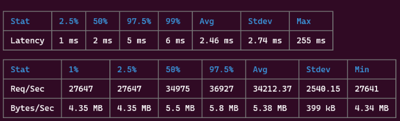
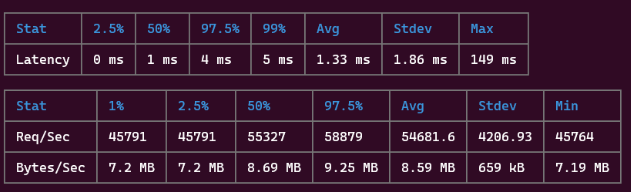
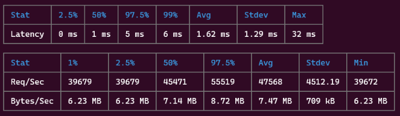
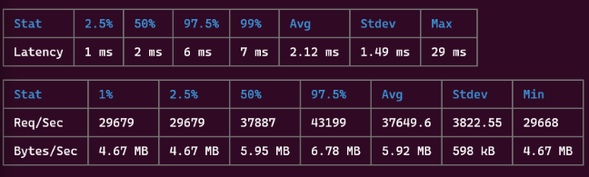

## Run

Use `npm run start` to run the server.
Use `npm run test` to run unit tests.
Use `npm run benchmark` to run the benchmarking tool. Note, the server must be running.

Additionally, you may manually run the server with the following command:

`POPULATION_DATA_PATH="static/city_populations.csv" FASTIFY_CLUSTER_WORKERS=8 node src/server.js`

Environment variables are used throughout the project to configure import settings. An alternative would be using command line arguments, but environment variables provide a few advantages:

- They allow configuration options to be available at any level of code without needing to chain function arguments down.
- Used along with `dot-env`, it is easy to push new options via files on managed production machines.

## Design

There are three major components to the design of the API, they are:

1. Server (src/server.js)

This is the entry-point logic of the web application. Notably, I configure a `fastify` webserver and register my application routes. Additionally, I leveraged NodeJS's [cluster](https://nodejs.org/api/cluster.html) mechanism to improve performance. The primary cluster node behaves like the database source of truth for the application, while the worker nodes are responsible for application routing.

2. Application Routing (src/routes/population.js)

This component is responsible for consuming user requests, parsing it, and applying business logic rules while working with other components to serve data to the user quickly.

3. Population Data Manager (`src/components/population-manager.js`)

This component is the one-stop shop internal API for accessing and managing population data. It's core implementation is a process-local memory cache on the primary node that serves as an in-memory database for population data. By keeping these information readable in-memory, we don't need to incur additional costs like reading from disk. The main overhead cost is the Inter-Process Communication (IPC) cost between the worker and primary node (handled by `cluster-shared-memory`). On linux, these are implemented via pipes or unix sockets which in general have low overhead. Additionally, the Population Data Manager also handles persisting data for the caller in background by using a file-based key/value storage mechanism (implement by `node-persist`). This design was intentional, as the preference was to make the web server CPU-bound instead of IO-bound on interacting with the file-system. As far as utility, it provides functionality for loading data from a CSV as well as persistent storage. 

The primary bottleneck of the design is the in-memory database handled by the single primary node. See the section **Future Work** for improvements.

One performance optimization was to ensure that all CSV and persistent data loading happened at web application start-up. While this increases the initial load time of the webserver, it means we do not need to amortize that disk read costs while servicing client requests.

## Dependencies Used 

I want to go over what third-party dependencies were used and why as one of the design goals of this project was to keep dependencies to a minimum.

### fastify

Some kind web server framework is necessary as a launching off point. While it's possible to use pure NodeJS to run a server, Fastify shows that they have an [increased emphasis](https://fastify.dev/benchmarks) on HTTP optimization. Another framework alternative is NestJS which is more appropriate for larger teams and if the server needed to more features than just serving as an API server. Because of this, Fastify was the clear choice from a performance standpoint.

### cluster-shared-memory

Because of the design of the project, I needed to leverage IPC channels to facilitate communication between the workers nodes and the primary node. The implementation of this third party dependency was straight-forward and close to what a pure vanilla implementation would look anyways so I elected to include it and save time re-implementing a similar strategy.

### csv-parser

CSV parsing is fairly trivial to implement but there are a few gotcha cases. I elected not to reinvent the wheel and instead go with a well-maintained library, particularly since CSV parsing is not a bottleneck to the web server's performance.

## Benchmark Results

Benchmarking testing was done by running the node server with  

`POPULATION_DATA_PATH="static/city_populations.csv" FASTIFY_CLUSTER_WORKERS=N node src/server.js`

Where N is the number of workers. The `.persist-population` directory was deleted between runs.
### 1 Worker

### 2 Worker

### 4 Worker

### 8 Worker

The application server topped at a respectable 54,681 requests per second with two workers. As the number of workers were increased past 2 the latency of each request went down while the total number of requests were also reduced, leading to believe the primary cluster node was hitting its bottleneck.

## Future Work

### Use a database service, like Redis

One of the goals of the project was to implement the full stack as a single NodeJS project. However, in a real production use case making `Population Data Manager` backed by a full database would drastically improve scalability of the service. Redis is a good fit as the in-memory key/value performance is good and it has options for on-disk persistence out of the box. 

### Implement LRU Caching

Because the primary node acts as a bottleneck to reading data, one way to alleviate that pressure is to cache some of the data on the workers. This is with the assumption that the number of reads the service performs is far greater than the number of writes. Implementing LRU caching would be trivial with the `Population Data Manager`'s getter methods. Each spawned worker would maintain its own LRU cache (which can be tuned to fit a certain memory footprint or with a time-to-live). Additional logic would have to be added to clear the cache whenever a particular key is saved with a new value.

